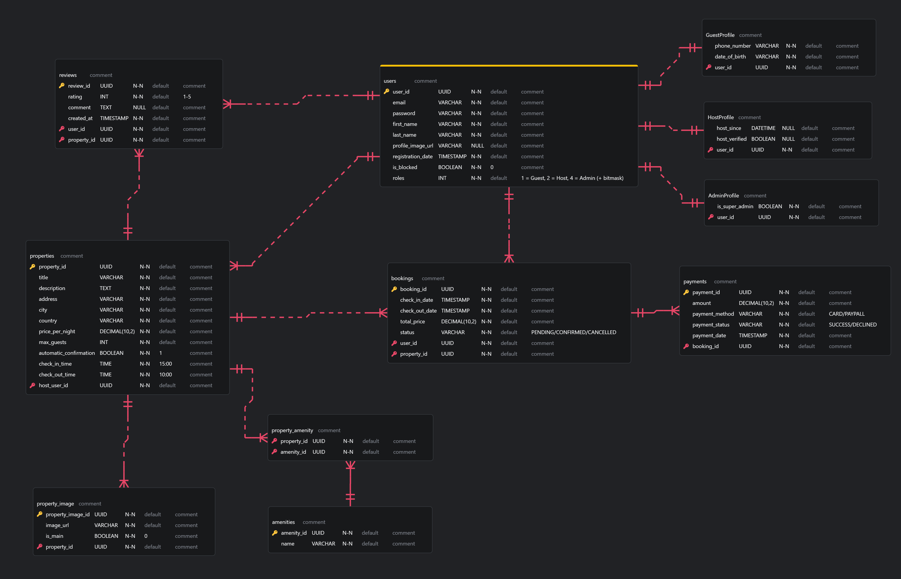

# Project Overview

This project is a RESTful backend API for a property booking platform, 
similar in concept to short-term rental marketplaces (i.e. Airbnb or Booking.com).

It allows users to register, list properties, search and book accommodations, 
leave reviews, and handle payments, while enforcing role-based access control 
and business rules.

The application is built with Java and Spring, follows a layered architecture 
(controllers, services, repositories), and uses JWT-based authentication 
to secure endpoints. It integrates multiple third-party APIs and demonstrates 
advanced querying, validation, and domain modeling.


# How To Run The Project

## Environment file configuration
Please edit the `env.properties` file located at the root of the project 
(same level as `src` folder) and set up the PostgreSQL connection details 
(according to your machine's setup)
in:
- PG_USERNAME
- PG_PASSWORD

Make sure to create a piccaro_submission database before running the application.

> **Please note**: I have also included a `data.sql` file that will pre-populate 
> some tables in the database to make testing easier. This includes ready-to-use 
> user accounts, properties, etc. There is no need to run this `data.sql` file manually,
> as it will be executed on each application startup, and records that already exist
> will be skipped.

## Postman Collection

Please download Postman and import the collection located in:

`postman/collections/Piccaro - Back-End Programming Submission.postman_collection.json`

### About the Postman Collection

I have tried to make the Postman Collection as easy and usable as possible. 
A few notes:
- All requests already include a `Authorization Bearer {{BearerToken}}` header. 
  - The collection includes a Post-Response script that 
  checks whether a request was made to the /auth/login endpoint, 
  and automatically refreshes/deletes the BearerToken in the Global Variables 
  according to the login outcome.
- I have tried to include as many examples as possible to make testing easier.
  - I have marked some endpoints as Customizable to encourage testing with custom values
  - For all Customizable endpoint (wherever possible) there are also Ready to Use examples
  with populated request bodies to showcase the API functionality
- If the functionality of an endpoint isn't clear, please check the **API Endpoints**
section where I have included explanation, business rules clarifications, payload 
and response details for all API endpoints. 

# About The project

## ERD


> Please note: as per submission requirement, a hierarchy structure can be found
> in the Payment entities, where Payment is the base entity, and CardPayment and 
> PaypalPayment extend the base Payment entity.

## User Roles

The platform supports three main user roles.

### Guest
  - Can search for properties using filters (city, price, amenities, guests, etc.)
  - Can book available properties
  - Can leave reviews for properties they have booked
  - Can manage their own profile
### Host
  - Can create and manage properties
  - Can define property details such as pricing, amenities, images, and availability
  - Can view bookings for their properties
### Admin
  - Has elevated permissions for platform management
  - Can access restricted administrative endpoints
  - May not necessarily act as a Host or Guest

> **Important**: A single user account can hold multiple roles 
> (i.e. a user can be both a Host and a Guest).
> This is implemented using a roles bitmask, where each role is mapped to 
> a specific bit (Guest = 1, Host = 2, Admin = 4).
> By combining these values, multiple roles can be assigned to the same user 
> (i.e. 1 + 2 = 3 → Guest and Host), 
> similar to how permission flags work in Linux.

## Key Features

- User authentication and authorization with JWT
- Role-based access control
- Property creation, editing, and advanced search with filtering, sorting, and pagination
- Booking system with date availability checks
- Review system
- Payment hierarchy (i.e. Card and PayPal) with currency conversion
- Aggregated statistics (i.e. property stats by city)
- Integration with third-party APIs for images and exchange rates
- Robust validation and error handling

## Authentication and Security

The application uses JWT tokens for stateless authentication and authorization.

When a user successfully logs in or registers, the backend issues a signed JWT containing essential claims, such as:
- User ID
- Email
- Roles
- Blocked status
- Admin flags (i.e. super admin)

By embedding this information directly in the token, the application 
can extract authentication and authorization data without 
querying the database on every request, improving performance and scalability.

Also, the API endpoints are protected by @PreAuthorize annotations 
to enforce role-based access to certain actions. 

### JWT Filter

A custom JWT authentication filter intercepts incoming requests and:
- Extracts the JWT from the Authorization header
- Verifies the token’s signature and expiration
- Reads claims from the token
- Builds the Spring Security authentication context accordingly
- If the token is invalid, expired, or the user is blocked, 
the request is rejected before reaching the controller layer.

This approach ensures:
- Stateless authentication
- Separation of authentication and business logic
- Consistent security enforcement across the entire API

## Exception Handling
The application uses a `GlobalExceptionHandler` to centrally 
manage all runtime and validation exceptions.

This ensures that errors are returned in a consistent and 
structured JSON format, rather than default stack traces.

Custom exceptions are mapped to appropriate HTTP status codes 
(e.g. 400, 401, 403, 404). 
Stack traces are not shown, unless there's a 
500 Internal Server Error exception 
(this choice was made to allow for easier testing).

## 3rd-Party APIs

The 3rd-party APIs I have integrated are:
- pexels.com/api/: used to associate random photos to each new property
  - I have tried to randomize the image associations as much as possible, by passing 
  different random keywords (i.e. 'hotel', 'cabin', 'house' etc.) on each request, 
  and choosing a random page number to pick the images from the JSON result set
- exchangerate-api.com: used to convert incoming payments from the chosen currency in EUR 
(where EUR is the standard currency of my application). 


# API Endpoints

## [GET] /auth/info

Get info about the currently logged-in user. Needs valid Bearer Token.

#### Headers:
```
Authorizarion: Bearer <BearerToken>
```

#### Response:
```json
{
  "userId": "<UUID>",
  "firstName": "<String>",
  "lastName": "<String>",
  "email": "<String>",
  "isBlocked": "<Boolean>",
  "roleNames": [
    "GUEST",
    "HOST",
    "ADMIN"
  ],
  "accessToken": "<String>"
}
```

## [POST] /auth/register/:role

Register a new user. Role can be `guest` or `host`. Please note:
- During registration, the provided email address is checked against existing users in the database.
- If a user with the same email already exists **but does not yet have the requested role**, the registration is allowed.
  - The existing user record will be updated and the requested role will be added to the user’s roles.
- If a user with the same email **and the same role** already exists, the request will be rejected due to a duplicate email.
- This design allows a single user account to be associated with multiple roles (i.e. both Host and Guest).

#### Body (JSON)
```json
{
  "email": "<String>",
  "password": "<String>",
  "firstName": "<String>",
  "lastName": "<String>",
  "phoneNumber": "<String - Required if role is 'guest'>",
  "dateOfBirth": "<YYYY-MM-DD - Required if role is 'guest'>"
}
```

#### Response:
```json
{
    "userId": "<UUID>"
}
```

## [POST] /auth/login 

Login a user. Please note:
- The Postman collection has ready-to-use endpoints to log in with each role for easier testing:
  - Login as Guest
  - Login as Host
  - Login as Guest & Host User (both roles)
  - Login as Basic Admin
  - Login as Super Admin
  - Login as Blocked User
- Blocked users can still log in by design:
  - Login for a blocked user is allowed
  - However, blocked users cannot perform any actions other than 
  viewing their own information via `/auth/info`.
  - This is an intentional design choice to allow blocked users to:
    - View their account details 
    - Access contact information for support 
    - (Hypothetically) contact an administrator to request unblocking

#### Body (JSON)
```json
{
  "email": "<String>",
  "password": "<String>",
  "firstName": "<String>",
  "lastName": "<String>",
  "phoneNumber": "<String - Required if role is 'guest'>",
  "dateOfBirth": "<YYYY-MM-DD - Required if role is 'guest'>"
}
```

#### Response:
```json
{
    "accessToken": "<String>"
}
```


## [GET] /user/list

Get all users. Please note: Only admins are allowed to access this endpoint.

#### Headers:
```
Authorizarion: Bearer <BearerToken>
```

#### Response:
```json lines
[
  {
    "userId": "<UUID>",
    "email": "<String>",
    "firstName": "<String>",
    "lastName": "<String>",
    "profileImageUrl": "<String>",
    "registrationDate": "<YYYY-MM-DD>",
    "isBlocked": "<Boolean>",
    "roles": "<Integer>",
    "roleNames": [ "GUEST", "HOST", "ADMIN" ],
    "adminProfile": {
      "userId": "<UUID>",
      "isSuperAdmin": "<Boolean>"
    },
    "guestProfile": {
      "userId": "<UUID>",
      "dateOfBirth": "<YYYY-MM-DD>",
      "phoneNumber": "<String>"
    },
    "hostProfile": {
      "userId": "<UUID>",
      "hostSince": "<YYYY-MM-DD>",
      "hostVerified": "<Boolean>"
    }
  }
  // , ... more users
]
```


## [GET] /user/:user_id

Get user details by id. Please note:
- Only admins can get details of other admins.
- Regular users can only get details of Host or Guest users.

#### Headers:
```
Authorizarion: Bearer <BearerToken>
```

#### Response:
```json
{
  "userId": "<UUID>",
  "email": "<String>",
  "firstName": "<String>",
  "lastName": "<String>",
  "profileImageUrl": "<String>",
  "registrationDate": "<YYYY-MM-DD>",
  "isBlocked": "<Boolean>",
  "roles": "<Integer>",
  "roleNames": [ "GUEST", "HOST", "ADMIN" ],
  "adminProfile": {
    "userId": "<UUID>",
    "isSuperAdmin": "<Boolean>"
  },
  "guestProfile": {
    "userId": "<UUID>",
    "dateOfBirth": "<YYYY-MM-DD>",
    "phoneNumber": "<String>"
  },
  "hostProfile": {
    "userId": "<UUID>",
    "hostSince": "<YYYY-MM-DD>",
    "hostVerified": "<Boolean>"
  }
}
```

## [POST] /user/:user_id/upload-profile-picture

Upload profile picture for given user id. Please note:
- Only admins can upload profile pictures for other users.
- Regular users can only upload their own profile picture.

#### Headers:
```
Authorizarion: Bearer <BearerToken>,
Content-Type: multipart/form-data
```

#### Body (form-data):
```json
{
  "file": "<File>"
}
```

#### Response:
```json
{
  "profile-pic": "<String>"
}
```


## [PATCH] /user/:user_id

Update user details by id. Please note:
- Only admins can update details of other users.
- Regular users can only update their own details.
- Passwords cannot be updated via this endpoint.
  - To change password, use dedicated password change endpoint.
- Only guests are allowed to update their phone number and date of birth.
- Only the fields that were provided in the request will be overwritten in the database 
  - (i.e. if no firstName is provided in the request, then the original firstName will persist)

#### Headers:
```
Authorizarion: Bearer <BearerToken>
```

#### Body:
```json
{
  "firstName": "<String - optional>", 
  "lastName": "<String - optional>",
  "dateOfBirth": "<YYYY-MM-DD - optional>",
  "phoneNumber": "<String - optional>"
}
```

#### Response:
```json
{
  "userId": "<UUID>",
  "email": "<String>",
  "firstName": "<String>",
  "lastName": "<String>",
  "profileImageUrl": "<String>",
  "registrationDate": "<YYYY-MM-DD>",
  "isBlocked": "<Boolean>",
  "roles": "<Integer>",
  "roleNames": [ "GUEST", "HOST", "ADMIN" ],
  "adminProfile": {
    "userId": "<UUID>",
    "isSuperAdmin": "<Boolean>"
  },
  "guestProfile": {
    "userId": "<UUID>",
    "dateOfBirth": "<YYYY-MM-DD>",
    "phoneNumber": "<String>"
  },
  "hostProfile": {
    "userId": "<UUID>",
    "hostSince": "<YYYY-MM-DD>",
    "hostVerified": "<Boolean>"
  }
}
```


## [PATCH] /user/:user_id/password-reset

Reset password for the specified user. Please note:
- Only admins can reset the password of other users.
  - Admins can reset another user's password without knowing their old password.
- Regular users can only reset their own password.
    - Regular users must provide their old password to set a new one

#### Headers:
```
Authorizarion: Bearer <BearerToken>
```

#### Body:
```json
{
  "newPassword": "<String>", 
  "oldPassword": "<String - only required if logged in as regular user>"
}
```

#### Response:
```
200 OK
```


## [DELETE] /user/:user_id

Delete user by id. Please note:
- Only admins can delete other users.
- Regular users can only delete their own account.

#### Headers:
```
Authorizarion: Bearer <BearerToken>
```

#### Response:
```
204 No Content
```


## [GET] /property/:property_id

Get property details by id.

#### Headers:
```
Authorizarion: Bearer <BearerToken>
```

#### Response:
```json
{
  "title": "<String>",
  "description": "<String>",
  "address": "<String>",
  "city": "<String>",
  "country": "<String>",
  "pricePerNight": "<Decimal>",
  "maxGuests": "<Integer>",
  "automaticConfirmation": "<Boolean>",
  "checkInTime": "<HH:mm:ss>",
  "checkOutTime": "<HH:mm:ss>",
  "amenityNames": [ ],
  "averageRating": "<Decimal>",
  "imageUrls": [ ],
  "listedBy": "<String>",
  "propertyId": "<UUID>",
  "reviews": [ ],
  "totalReviews": "<Integer>"
}
```


## [GET] /property/my

Get all properties owned by the authenticated user. Please note:
- Only hosts can access this endpoint.

#### Headers:
```
Authorizarion: Bearer <BearerToken>
```

#### Response:
```json lines
[
  {
    "title": "<String>",
    "description": "<String>",
    "address": "<String>",
    "city": "<String>",
    "country": "<String>",
    "pricePerNight": "<Decimal>",
    "maxGuests": "<Integer>",
    "automaticConfirmation": "<Boolean>",
    "checkInTime": "<HH:mm:ss>",
    "checkOutTime": "<HH:mm:ss>",
    "amenityNames": [ ],
    "averageRating": "<Decimal>",
    "imageUrls": [ ],
    "listedBy": "<String>",
    "propertyId": "<UUID>",
    "reviews": [ ],
    "totalReviews": "<Integer>"
  }
  // , ... other properties
]
```


## [GET] /property/search

Search properties by a series of query parameters. Please note:
- Amenities may be passed for filtering as a comma-separated list (i.e. 'Wi-Fi,Parking')
  - Only properties having all specified amenities will be returned
- Paging starts from page 0 (therefore, to get results from the first page, use page=0)
- Sorting is only allowed by pricePerNight, maxGuests or title
  - The fallback sorting is by pricePerNight 

#### Headers:
```
Authorizarion: Bearer <BearerToken>
```

#### Query parameters:
```
/property/search
?city=<String>
&country=<String>
&amenities=<Comma-separated list>
&hostVerified=<Boolean>
&minPrice=<Decimal>
&maxPrice=<Decimal>
&minGuests=<Integer>
&page=<Integer>
&size=<Integer>
&sortBy=<String>
&direction=<ASC/DESC>
```

#### Response:
```json lines
[
  {
    "content": [
      {
        "title": "<String>",
        "description": "<String>",
        "address": "<String>",
        "city": "<String>",
        "country": "<String>",
        "pricePerNight": "<Decimal>",
        "maxGuests": "<Integer>",
        "automaticConfirmation": "<Boolean>",
        "checkInTime": "<HH:mm:ss>",
        "checkOutTime": "<HH:mm:ss>",
        "amenityNames": [ ],
        "averageRating": "<Decimal>",
        "imageUrls": [ ],
        "listedBy": "<String>",
        "propertyId": "<UUID>",
        "reviews": [ ],
        "totalReviews": "<Integer>"
      },
      // ... other properties
    ],
    "empty": "<Boolean>",
    "first": "<Boolean>",
    "last": "<Boolean>",
    "number": "<Integer>",
    "numberOfElements": "<Integer>",
    "pageable": {
      "offset": "<Integer>",
      "pageNumber": "<Integer>",
      "pageSize": "<Integer>",
      "paged": "<Boolean>",
      "sort": {
        "empty": "<Boolean>",
        "sorted": "<Boolean>",
        "unsorted": "<Boolean>"
      },
      "unpaged": "<Boolean>"
    },
    "size": "<Integer>",
    "sort": {
      "empty": "<Boolean>",
      "sorted": "<Boolean>",
      "unsorted": "<Boolean>"
    },
    "totalElements": "<Integer>",
    "totalPages": "<Integer>"
  }
]
```


## [GET] /property/stats

Get property statistics by city.

#### Headers:
```
Authorizarion: Bearer <BearerToken>
```

#### Response:
```json lines
[
  {
    "city": "Milano",
    "count": "<Integer>",
    "avgPrice": "<Decimal>",
    "minPrice": "<Decimal>",
    "maxPrice": "<Decimal>"
  },
  {
    "city": "Roma",
    "count": "<Integer>",
    "avgPrice": "<Decimal>",
    "minPrice": "<Decimal>",
    "maxPrice": "<Decimal>"
  },
  // ... Other cities
]
```


## [POST] /property

Creates a property. Please note:
- Only hosts can access this endpoint.
- To make the endpoint easier to use, whenever a property is created, it is assigned:
  - A set of random amenities
  - A set of random property images (from pexels.com API)
- By design, properties are only allowed for:
  - Country: IT
  - City: 'Torino', 'Milano', 'Roma', or 'Napoli'
  - This choice was made to ensure easier testing on properties search

#### Headers:
```
Authorizarion: Bearer <BearerToken>
```

#### Body:
```json
{
  "title": "<String>",
  "description": "<String>",
  "address": "<String>",
  "city": "<String>",
  "country": "<String>",
  "pricePerNight": "<Decimal>",
  "maxGuests": "<Integer>",
  "automaticConfirmation": "<Boolean - optional>",
  "checkInTime": "<HH:mm:ss - optional>",
  "checkOutTime": "<HH:mm:ss - optional>"
}
```

#### Response:
```json
{
  "title": "<String>",
  "description": "<String>",
  "address": "<String>",
  "city": "<String>",
  "country": "<String>",
  "pricePerNight": "<Decimal>",
  "maxGuests": "<Integer>",
  "automaticConfirmation": "<Boolean>",
  "checkInTime": "<HH:mm:ss>",
  "checkOutTime": "<HH:mm:ss>",
  "amenityNames": [ ],
  "averageRating": "<Decimal>",
  "imageUrls": [ ],
  "listedBy": "<String>",
  "propertyId": "<UUID>",
  "reviews": [ ],
  "totalReviews": "<Integer>"
}
```


## [PATCH] /property/:property_id

Update property details by id. Please note:
- Only hosts and admins can access this endpoint.
- Only admins can edit other users' properties.
- A host may only edit their own properties. 
If a host attempts to edit a property that is owned by a 
different user, the API request will be denied.
- By design, it is not possible to edit a property's country or city.
  - If a property was relocated in a different city, delete it and create a new one. 
- Only the fields that were provided in the request will be overwritten in the database
    - (i.e. if no address is provided in the request, then the original address will persist)

#### Headers:
```
Authorizarion: Bearer <BearerToken>
```

#### Body:
```json
{
  "title": "<String - optional>",
  "description": "<String - optional>",
  "address": "<String - optional>",
  "pricePerNight": "<Decimal - optional>",
  "maxGuests": "<Integer - optional>",
  "automaticConfirmation": "<Boolean - optional>",
  "checkInTime": "<HH:mm:ss - optional>",
  "checkOutTime": "<HH:mm:ss - optional>"
}
```

#### Response:
```json
{
  "title": "<String>",
  "description": "<String>",
  "address": "<String>",
  "city": "<String>",
  "country": "<String>",
  "pricePerNight": "<Decimal>",
  "maxGuests": "<Integer>",
  "automaticConfirmation": "<Boolean>",
  "checkInTime": "<HH:mm:ss>",
  "checkOutTime": "<HH:mm:ss>",
  "user": { },
  "amenities": [ ],
  "images": [ ],
  "propertyId": "7cf3291b-4489-40eb-ab7b-18ae370cc3d8"
}
```


## [DELETE] /property/:property_id

Delete property by id. Please note:
- Only hosts and admins can access this endpoint.
- Only admins can delete other users' properties.
- Hosts can only delete their own properties.

#### Headers:
```
Authorizarion: Bearer <BearerToken>
```

#### Response:
```
204 No Content
```


## [POST] /property/:property_id/review

Create a review for a property. Please note:
- Only guests can access this endpoint.
- A guest may not leave multiple reviews for the same property.
  - Attempting to add more than one review for the same property will result in a Forbidden API error.
- A guest may not leave a review for a property they never booked
  - The booking(s) must be already completed (checkOutDate <= today)

#### Headers:
```
Authorizarion: Bearer <BearerToken>
```

#### Body:
```json
{
  "rating": "<Integer>",
  "comment": "<String>"
}
```

#### Response:
```json
{
  "rating": "<Integer>",
  "comment": "<String>",
  "createdAt": "<LocalDate>",
  "reviewId": "<UUID>"
}
```


## [POST] /property/:property_id/book

Create a booking against a property. Please note:
- Only guests can access this endpoint.
- Two different payment types are accepted: Card and PayPal.
  - The relevant fields should be provided for the chosen payment method.
- If the chosen property has automatic confirmation,
the booking and payment will be automatically confirmed.
Otherwise, they will remain PENDING/ON HOLD until the host of 
the specified property confirms (or cancels) the booking.
- By design, the base currency of the application is EUR. 
Although, payments in other currencies are accepted. The payments table will therefore show:
  - currency: The currency the payment was made in
  - amount_charged: The amount in the specified currency
  - amount_eur: The amount in EUR
  - This design choice was made to showcase the use of a 3rd-party exchange rate API.

#### Headers:
```
Authorizarion: Bearer <BearerToken>
```

#### Body:
```json
{
  "checkInDate": "<YYYY-MM-DD>",
  "checkOutDate": "<YYYY-MM-DD>",
  "paymentType": "<String - 'PayPal' or 'Card'>",
  "currency": "<3-letter currency code>",

  "cardNumber": "<cardNumber - required only for paymentType=card>",
  "cardHolder": "<cardHolder - required only for paymentType=card>",
  "cardExpiry": "<cardExpiry - required only for paymentType=card>",

  "paypalEmail": "<paypalEmail - required only for paymentType=paypal>",
  "paypalTransactionId": "<paypalTransactionId - required only for paymentType=paypal>"
}
```

#### Response:
```json
{
  "checkInDate": "<YYYY-MM-DD>",
  "checkOutDate": "<YYYY-MM-DD>",
  "totalPrice": "<Decimal>",
  "status": "<String>",
  "user": { },
  "property": { },
  "id": "<UUID>"
}
```


## [POST] /booking/:booking_id/approve

Approve a booking. Please note:
- Only hosts can access this endpoint.
- A host is authorized to approve their own properties' bookings only.
  - Attempting to approve a booking that is not owned by the authenticated user
will result in Access Denied API error.

#### Headers:
```
Authorizarion: Bearer <BearerToken>
```

#### Response:
```json
{
  "checkInDate": "<YYYY-MM-DD>",
  "checkOutDate": "<YYYY-MM-DD>",
  "totalPrice": "<Decimal>",
  "status": "<String>",
  "user": { },
  "property": { },
  "id": "<UUID>"
}
```


## [POST] /booking/:booking_id/reject

Reject a booking. Please note:
- Only hosts can access this endpoint.
- A host is authorized to reject their own properties' bookings only.
    - Attempting to reject a booking that is not owned by the authenticated user
      will result in Access Denied API error.
- By design, a booking that is already confirmed cannot be rejected.
- A rejected booking will be deleted, and the relevant payment(s) will be deleted too.

#### Headers:
```
Authorizarion: Bearer <BearerToken>
```

#### Response:
```
204 No Content
```


## [GET] /booking/:booking_id

Get a booking by ID. Please note:
- Only Admins are allowed to view all bookings.
- Guests are only allowed to access their own bookings.
- Hosts are only allowed to access bookings against their own properties.

#### Headers:
```
Authorizarion: Bearer <BearerToken>
```

#### Response:
```json lines
{
  "checkInDate": "<YYYY-MM-DD>",
  "checkOutDate": "<YYYY-MM-DD>",
  "totalPrice": "<Decimal>",
  "status": "<String>",
  "user": { },
  "property": { },
  "id": "<UUID>"
}
```


## [GET] /booking/my

Get all bookings for the currently authenticated user. Please note:
- Only guests can access this endpoint.

#### Headers:
```
Authorizarion: Bearer <BearerToken>
```

#### Response:
```json lines
[
  {
    "checkInDate": "<YYYY-MM-DD>",
    "checkOutDate": "<YYYY-MM-DD>",
    "totalPrice": "<Decimal>",
    "status": "<String>",
    "user": { },
    "property": { },
    "id": "<UUID>"
  }
  //, ... other bookings
]
```


## [DELETE] /booking/:booking_id

Delete a booking by ID. Please note:
- Only guests can access this endpoint.
- Guests are only allowed to delete their own bookings.

#### Headers:
```
Authorizarion: Bearer <BearerToken>
```

#### Response:
```
204 No Content
```


## [POST] /admin

Create an admin user. Please note:
- Only admins can access this endpoint.
- By design, Basic Admins are not allowed to create Super Admins.

#### Headers:
```
Authorizarion: Bearer <BearerToken>
```

#### Request:
```json
{
  "email": "<String>",
  "password": "<String>",
  "firstName": "<String>",
  "lastName": "<String>",
  "isSuperAdmin": "<Boolean>"
}
```

#### Response:
```json
{
  "userId": "<UUID>",
  "email": "<String>",
  "firstName": "<String>",
  "lastName": "<String>",
  "isBlocked": "<Boolean>",
  "profileImageUrl": "<String>",
  "registrationDate": "<LocalDate>",
  "roles": 4,
  "roleNames": [ ],
  "adminProfile": { }
}
```


## [POST] /admin/:user_id/block

Block a user by ID. Please note:
- Only admins can access this endpoint.
- A super admin is allowed to block any user
- A basic admin is allowed to block any user except Super Admins.

#### Headers:
```
Authorizarion: Bearer <BearerToken>
```

#### Response:
```json
{
  "userId": "<UUID>",
  "email": "<String>",
  "firstName": "<String>",
  "lastName": "<String>",
  "profileImageUrl": "<String>",
  "registrationDate": "<YYYY-MM-DD>",
  "isBlocked": "<Boolean>",
  "roles": "<Integer>",
  "roleNames": [ "GUEST", "HOST", "ADMIN" ],
  "adminProfile": {
    "userId": "<UUID>",
    "isSuperAdmin": "<Boolean>"
  },
  "guestProfile": {
    "userId": "<UUID>",
    "dateOfBirth": "<YYYY-MM-DD>",
    "phoneNumber": "<String>"
  },
  "hostProfile": {
    "userId": "<UUID>",
    "hostSince": "<YYYY-MM-DD>",
    "hostVerified": "<Boolean>"
  }
}
```


## [POST] /admin/:user_id/unblock

Unblock a user by ID. Please note:
- Only admins can access this endpoint.

#### Headers:
```
Authorizarion: Bearer <BearerToken>
```

#### Response:
```json
{
  "userId": "<UUID>",
  "email": "<String>",
  "firstName": "<String>",
  "lastName": "<String>",
  "profileImageUrl": "<String>",
  "registrationDate": "<YYYY-MM-DD>",
  "isBlocked": "<Boolean>",
  "roles": "<Integer>",
  "roleNames": [ "GUEST", "HOST", "ADMIN" ],
  "adminProfile": {
    "userId": "<UUID>",
    "isSuperAdmin": "<Boolean>"
  },
  "guestProfile": {
    "userId": "<UUID>",
    "dateOfBirth": "<YYYY-MM-DD>",
    "phoneNumber": "<String>"
  },
  "hostProfile": {
    "userId": "<UUID>",
    "hostSince": "<YYYY-MM-DD>",
    "hostVerified": "<Boolean>"
  }
}
```